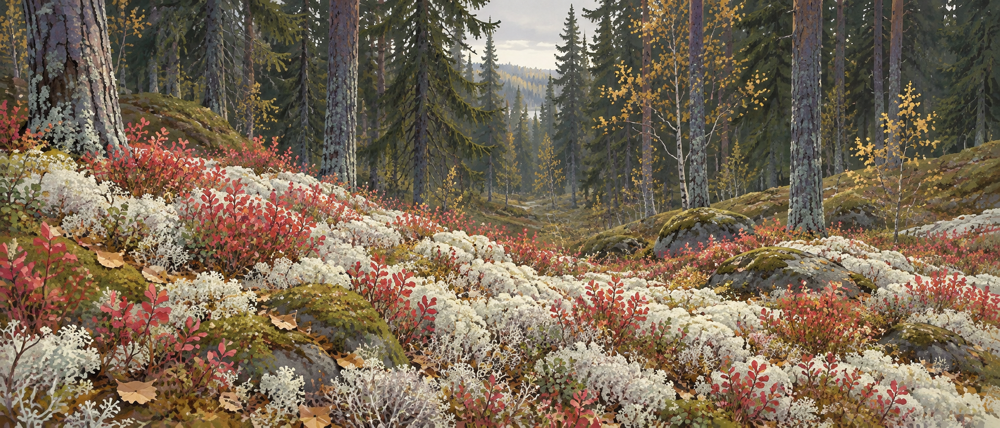
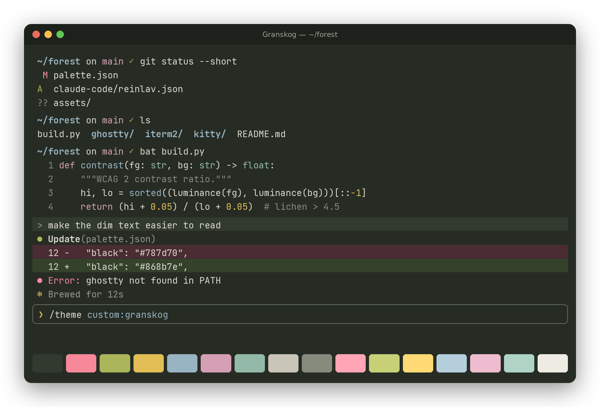
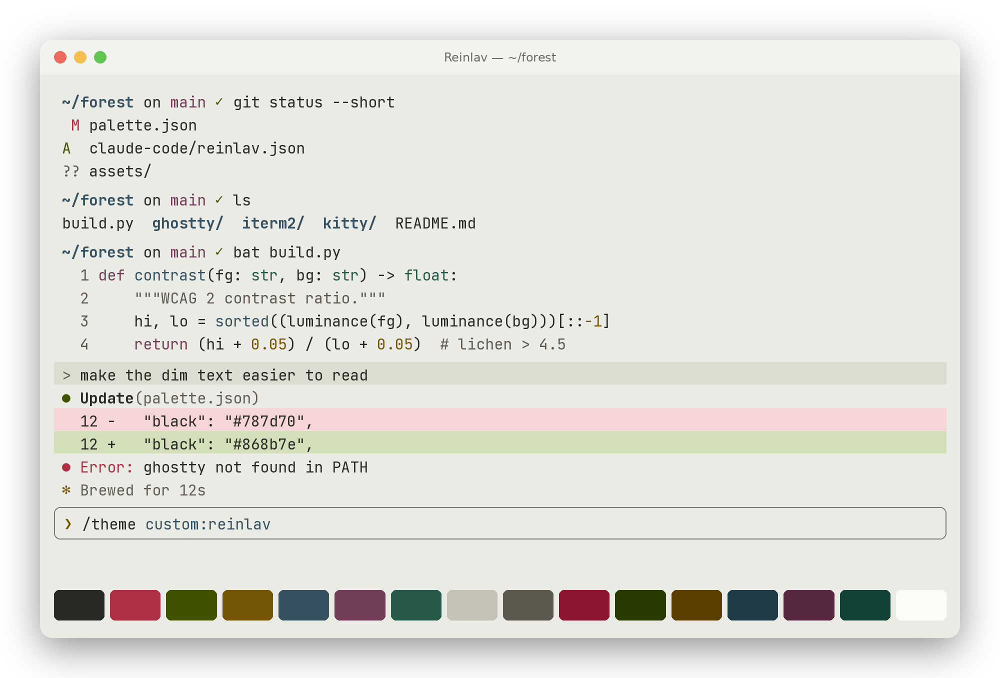
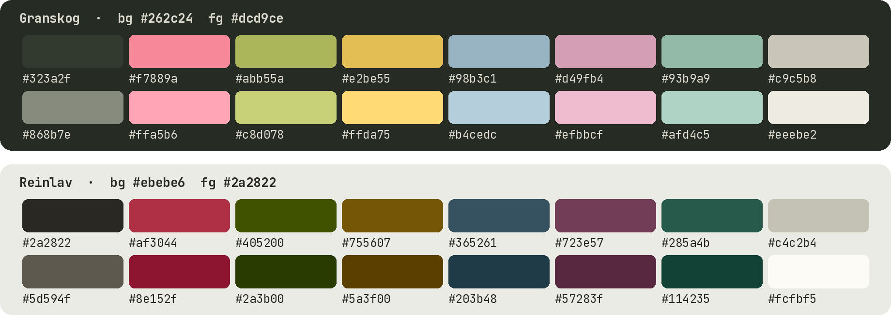

<h1 align="center">Granskog</h1>

<p align="center">
  A terminal color theme sampled from a Norwegian forest floor in October.<br>
  <b>Granskog</b> (dark) · <b>Reinlav</b> (light)
</p>



*Granskog* is Norwegian for spruce forest. *Reinlav* is reindeer lichen, the soft grey-white carpet that covers the ground beneath it.

The colors were sampled from photographs of a Norwegian forest floor. The banner is an illustration inspired by that landscape. The lichen gives the light background and the spruce gives the dark one. Blueberry heather turning red gives the red, the last birch leaves give the yellow, and lingonberry and moss give the green. The blue-grey comes from lichen on the pine bark. Everything is muted, the way a forest looks on an overcast autumn day.

## Granskog (dark)



## Reinlav (light)



## Palette



The full palette, including Claude Code tokens, lives in [`palette.json`](palette.json).

## Install

Each folder has its own README with install steps.

| Tool | Files |
| :- | :- |
| Ghostty | [`ghostty/`](ghostty) |
| iTerm2 | [`iterm2/`](iterm2) |
| Claude Code | [`claude-code/`](claude-code) |
| Herdr | [`herdr/`](herdr) |
| Kitty | [`kitty/`](kitty) |
| Alacritty | [`alacritty/`](alacritty) |
| WezTerm | [`wezterm/`](wezterm) |

## Readability

Muted should not mean hard to read. Both themes are checked against WCAG 2 and APCA:

| | Granskog | Reinlav |
| :- | :-: | :-: |
| Foreground on background | 10.1 : 1 | 12.3 : 1 |
| Lowest ANSI color (red–cyan, normal and bright) | 6.1 : 1 | 5.3 : 1 |
| Dim text (bright black) | 4.1 : 1 | 5.8 : 1 |

- Neither background is pure black or white. That avoids glare on light themes and halation (glowing text) on dark ones.
- Red and green are separated by lightness as well as hue, so they stay distinct with red–green color blindness (deuteranopia).
- Red is reserved for errors. The cursor and accents use birch yellow and moss green.
- As in most light themes, Reinlav's white and bright white are close to the background, because programs use them as background colors.

Run `python3 build.py --check` to print the full report.

## Building

[`palette.json`](palette.json) is the single source of truth. After editing it, regenerate every port:

```sh
python3 build.py
```

It needs only the Python standard library. Ports for other tools are welcome; add a function to `build.py` instead of editing generated files by hand.

## License

[MIT](LICENSE)
