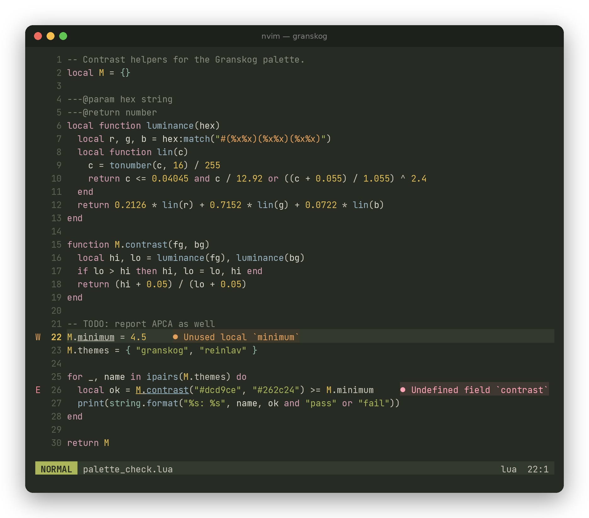
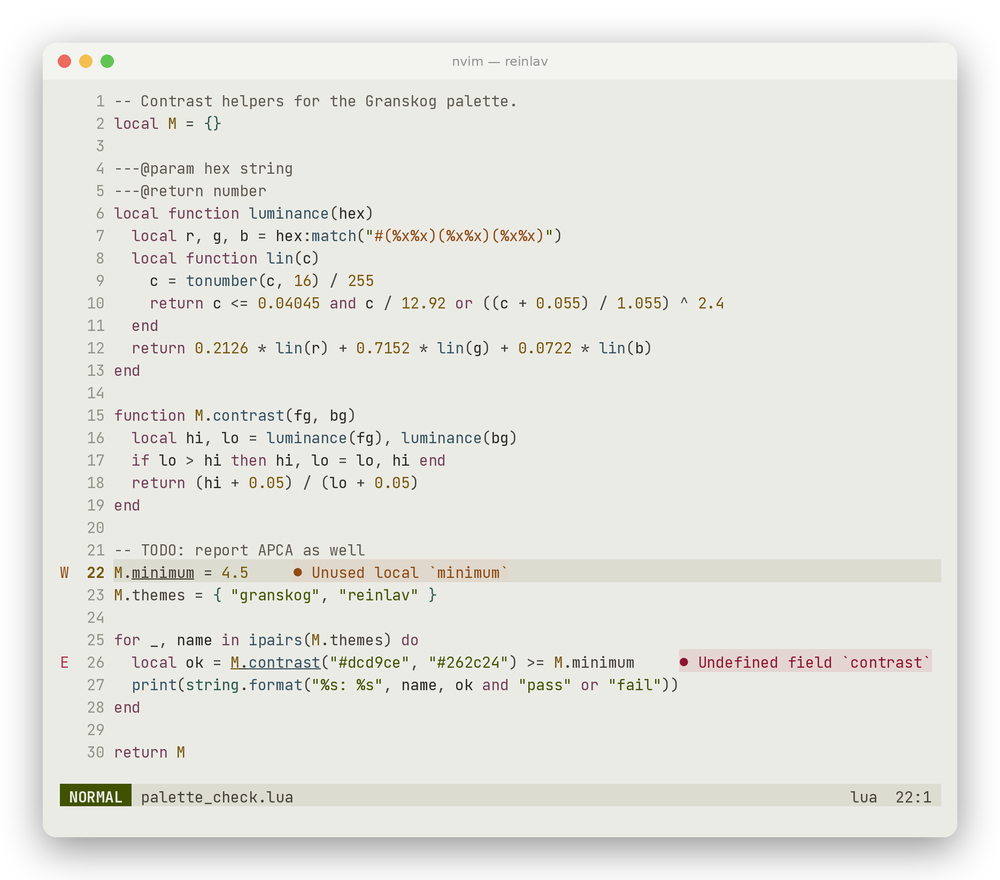

# Neovim

The repository is itself a Neovim plugin: the colour scheme lives in [`colors/`](../colors) and [`lua/granskog/`](../lua/granskog) at the root. Tested with Neovim 0.11.





## Install

With [lazy.nvim](https://github.com/folke/lazy.nvim):

```lua
{
  "HavardPede/granskog",
  lazy = false,
  priority = 1000,
  config = function()
    vim.cmd.colorscheme("granskog")
  end,
}
```

Any other plugin manager works the same way: add `HavardPede/granskog` and run `:colorscheme granskog`.

## Light and dark

`:colorscheme granskog` follows `'background'`: dark gives Granskog, light gives Reinlav. Neovim detects the terminal background on startup, so with Ghostty set to `theme = light:reinlav,dark:granskog` the editor matches without any extra setup. Plugins that flip `'background'` with the system appearance work too.

`:colorscheme reinlav` selects the light variant directly.

## Options

Call `setup` before loading the colour scheme:

```lua
require("granskog").setup({
  italic_comments = true, -- default
  transparent = false,    -- let the terminal background show through
})
```

## Plugins

Highlights are included for Treesitter, LSP semantic tokens and diagnostics, plus gitsigns, telescope, snacks, fzf-lua, nvim-cmp, blink.cmp, indent-blankline, mini.indentscope, mini.statusline, nvim-tree, neo-tree and which-key.

For lualine:

```lua
require("lualine").setup({ options = { theme = "granskog" } })
```

## Colour roles

Red is only used for errors, removed lines and deletions, never for syntax.

| Role | Colour |
| :- | :- |
| Keywords, control flow | Heather (magenta) |
| Functions | Lichen blue |
| Types, modules, built-ins | Spruce cyan |
| Strings | Moss (green) |
| Numbers, constants | Birch (yellow) |
| Escapes, regex, warnings | Rust (orange) |
| Comments | Dim grey |

The colours are generated into [`lua/granskog/palette.lua`](../lua/granskog/palette.lua) from [`palette.json`](../palette.json) by `build.py`. Edit the palette, not that file.
